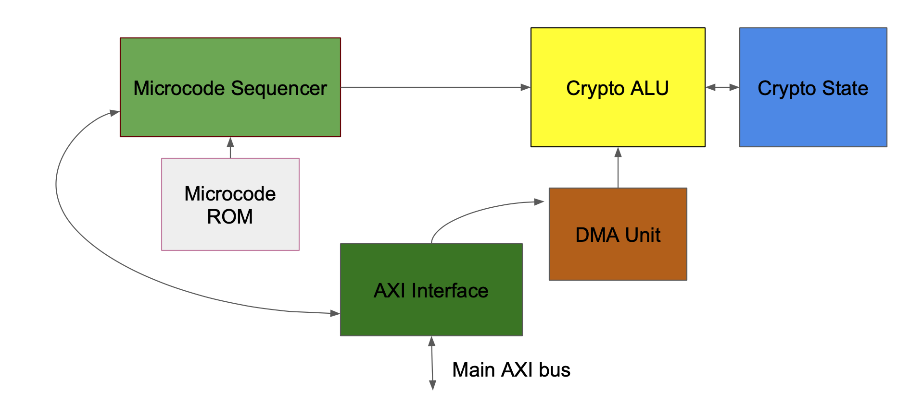

This repository contains Ford Seidel and Adilet Segizekov's 18-743 project. We are attempting to construct a SHA-3 accelerator for a Zynq Board. The design will be implemented in Verilog and will interface with the Zynq's CPU over an AXI interface. 

